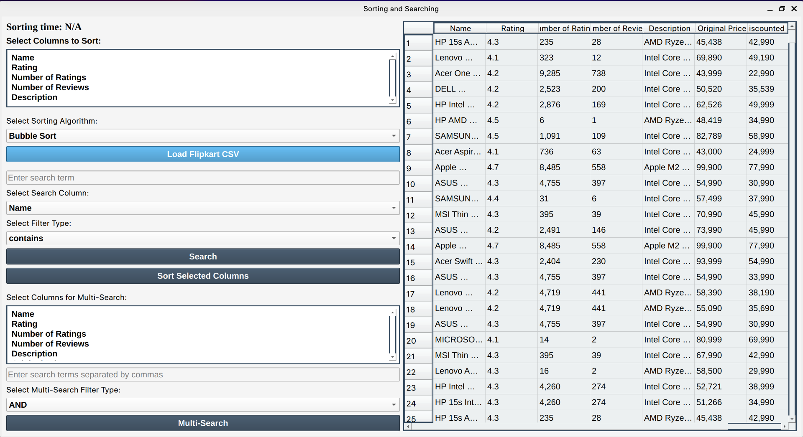

# Five Star Hostel

**Five Star Hostel** is a Window Form hostel management system developed in C# with MS SQL Server integration, implementing object-oriented programming principles. This user-friendly platform features distinct logins for students, resident tutors, and senior wardens. Students can manage profiles, request leave, and submit complaints, while resident tutors oversee hostel operations and senior wardens ensure efficient coordination across all hostels.

## Table of Contents
- [Features](#features)
- [Screenshots](#screenshots)
- [Usage](#usage)
- [Documentation](#documentation)
- [Technologies Used](#technologies-used)
- [Contributing](#contributing)
- [License](#license)

## Features
- **3 tier model**: Business layer, Data layer and User Interface
- **Modular Design DLL Framework**: Backend business logic and data handling separated into a DLL framework, making it reusable and flexible for future UI developments.
- **User Authentication**: Distinct logins for students, resident tutors, and senior wardens.
- **Profile Management**: Students can manage their profiles and submit complaints.
- **Leave Requests**: Students can request leave through the platform.
- **Admin Management**: Resident tutors and senior wardens can oversee operations and manage student requests.
- **Responsive Design**: A clean and modern interface that works well on various devices.

## Screenshots

## Usage
1. Clone the repository:
   `git clone https://github.com/miansaadtahir/fivestarhostel.git`
2. Navigate to the project directory:
   `cd FiveStarHostel/ HostelUI
/ Resistay/ bin/ debug`
3. Launch the `Resistay.exe` file.

## Documentation
For a detailed overview of the project and its features, visit the [Documentation](./documentation/) in the repository.

## Technologies Used
- C#
- MS SQL Server

## Contributing
Contributions, issues, and feature requests are welcome!  
Feel free to check out the [issues page](https://github.com/miansaadtahir/fivestarhostel/issues) for more information.

## License
Distributed under the MIT License. See [LICENSE](./LICENSE) for more details.
